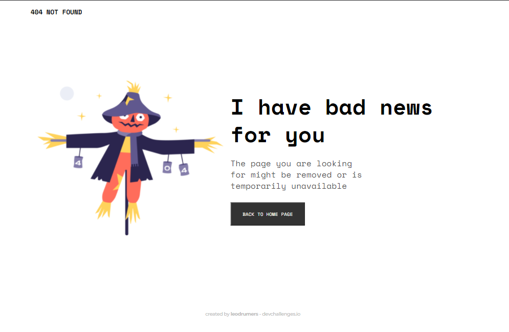
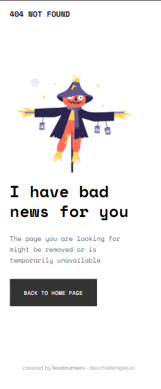

<!-- Please update value in the {}  -->

<h1 align="center">Scarecrow Page not found</h1>

   Solution for a challenge from  <a href="http://devchallenges.io" target="_blank">Devchallenges.io</a>.

  <h3>
    <a href="https://leodrumers.github.io/scarecrow-404/">
      Demo
    </a>
     | 
    <a href="https://github.com/leodrumers/scarecrow-404}">
      Solution
    </a>
     | 
    <a href="https://devchallenges.io/challenges/wBunSb7FPrIepJZAg0sY">
      Challenge
    </a>
  </h3>

<!-- TABLE OF CONTENTS -->

## Table of Contents

- [Overview](#overview)
  - [Built With](#built-with)
- [Features](#features)
- [Acknowledgements](#acknowledgements)
- [Contact](#contact)

<!-- OVERVIEW -->

## Overview

- Where can I see your demo?
  - This project is my solution for the challenge 'scarecrow 404 page not found and was built using HTML and sass
 - 
 - 

- What was your experience?
  - The best way to learn something is to work on it and I've learned a lot in this simple project  

### Built With

<!-- This section should list any major frameworks that you built your project using. Here are a few examples.-->
- Html5
- [Sass](https://sass-lang.com/)

## Features

This application/site was created as a submission to a [DevChallenges](https://devchallenges.io/challenges) challenge. The [challenge](https://devchallenges.io/challenges/wBunSb7FPrIepJZAg0sY) was to build an application to complete the given user stories.

## Acknowledgements

<!-- This section should list any articles or add-ons/plugins that helps you to complete the project. This is optional but it will help you in the future. For exmpale -->

- [Steps to replicate a design with only HTML and CSS](https://devchallenges-blogs.web.app/how-to-replicate-design/)
- [Node.js](https://nodejs.org/)
- [Marked - a markdown parser](https://github.com/chjj/marked)

## Contact

- GitHub [@leodrumers](https://github.com/leodrumers)
- Linkedin [@leodrumers](https://www.linkedin.com/in/leandro-h-ortiz-/)
- Twitter [@leodrumers](https://twitter.com/leodrumers)
